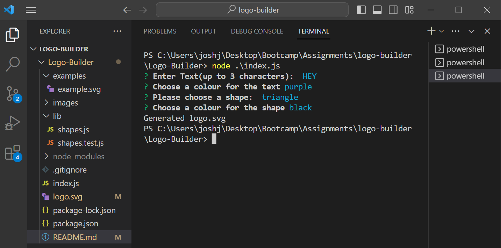
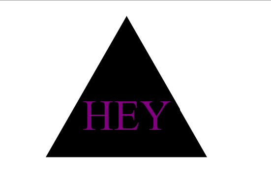

# SVG Logo Generator 

## Description 
Using Nodejs, inquirer, fs and jest(to test) if you answer the questions prompted to you. It will generate a Logo in SVG format. 

Please use this link to see the application in action:
https://drive.google.com/file/d/11g1JbsL6_BkZ83QVgyefej-PXEmro_Ku/view

## Photos
### Terminal input

### Generated Image

## Table of contents
- [Go to Installation](#installation) 
- [Go to Usage](#usage) 
- [Go to Contributing](#contributing) 
- [Go to Tests](#tests)
- [Go to License](#license)
- [Got to Questions](#questions)

## Installation
Git clone this repositories code. Open up the integrated terminal in VScode and type 'node index.js' and answer the questions.
    
## Usage
To create a SVG logo(with 3 characters)

## Contributing
N/A

## Tests
in the terminal, type 'npm test'

## License
This project is licensed under the MIT License - see https://mit-license.org/ for details.

https://opensource.org/licenses/MIT

## Questions

Please checkout my Github account: https://github.com/joshua-watson96 

Please e-mail me with any further questions:  joshjkwatson@gmail.com